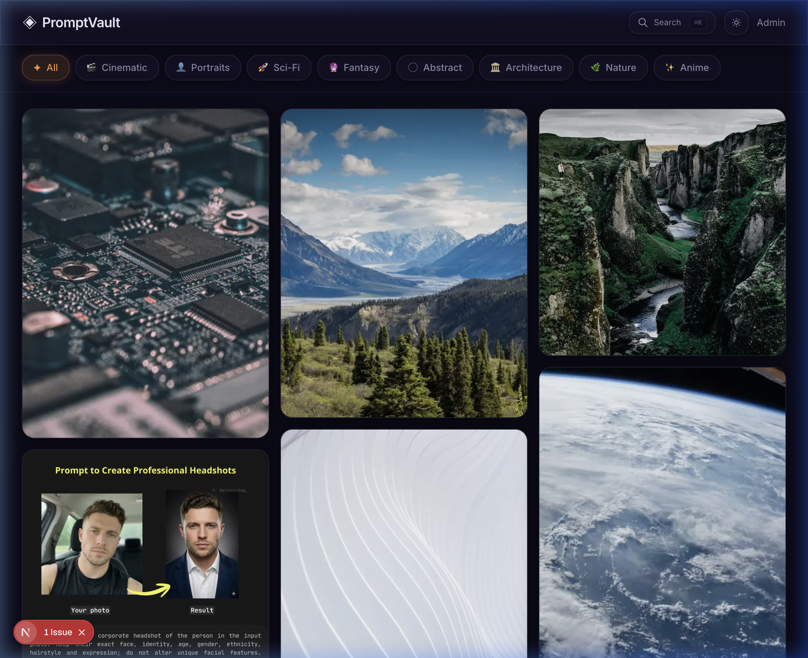
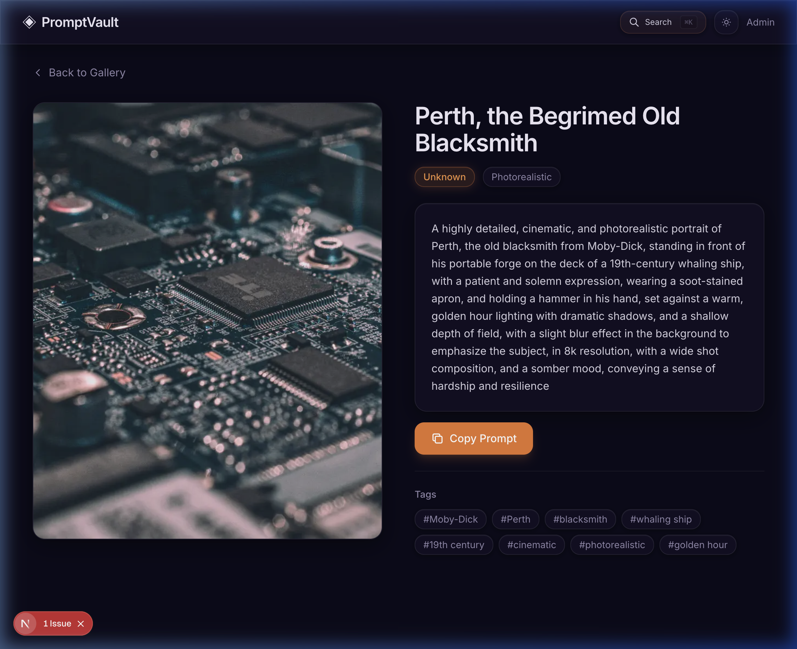
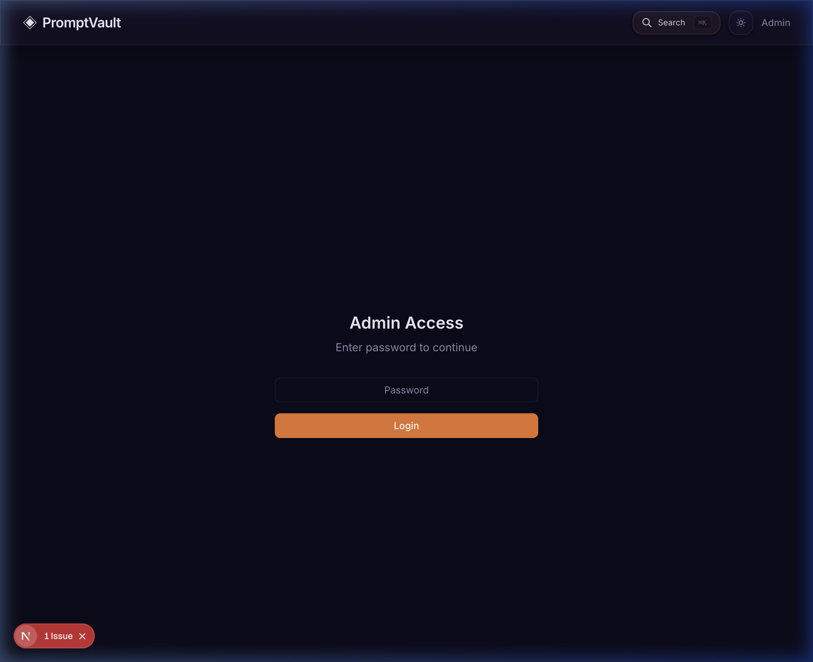

<p align="center">
  <h1 align="center">◈ PromptVault</h1>
  <p align="center">
    A visual AI prompt library with Apple-style liquid glass UI.<br/>
    Browse, search, and copy AI-generated prompts for Midjourney, DALL·E, Stable Diffusion, and more.
  </p>
</p>

<p align="center">
  
  
  
  
  
  
</p>

---

## 📖 Project Overview

**PromptVault** is a Pinterest-style visual library that curates AI-generated images and videos alongside their prompts. It solves the problem of creators endlessly searching Twitter, Discord, and Reddit for quality AI prompts by providing a single, beautiful, organized destination to discover and copy prompts instantly.

### Key Highlights

- 🎨 **Visual-first** — Masonry grid showcasing AI-generated artwork
- ⚡ **Instant copy** — One-click copy any prompt to clipboard
- 🔍 **Spotlight search** — `⌘K` search across titles, models, styles, and tags
- 🤖 **AI-powered scraping** — Paste any URL and Groq AI extracts the prompt automatically
- 🌗 **Dark/Light themes** — Deep purple dark + soft lavender light mode with persistence
- ✨ **Liquid Glass UI** — Apple-style glassmorphism across all components

### Who It's For

- AI filmmakers and video creators
- Digital artists using Midjourney, DALL·E, Runway, Sora
- Content creators exploring AI tools
- Beginners learning prompt engineering
- Professionals building prompt swipe files

---

## 🛠 Tech Stack

| Layer | Technology | Purpose |
|---|---|---|
| **Framework** | Next.js 16 (App Router) | SSR, API routes, file-based routing |
| **Runtime** | React 19 | Component rendering |
| **Language** | TypeScript 5 | Type safety |
| **Styling** | TailwindCSS v4 + shadcn/ui | Utility-first CSS + pre-built components |
| **Animations** | Framer Motion | Spring-based transitions, enter/exit animations |
| **AI** | Groq API (`llama-3.3-70b-versatile`) | Intelligent prompt extraction from URLs |
| **Scraping** | Cheerio | Server-side HTML parsing |
| **Storage** | JSON file (`data/prompts.json`) | Simple file-based data persistence |
| **Notifications** | Sonner | Toast notifications |
| **Bundler** | Turbopack | Fast development server |

---

## 🏗 Architecture

### System Overview

```
┌─────────────────────────────────────────────────────────┐
│                     CLIENT (Browser)                     │
│  ┌──────────┐  ┌──────────┐  ┌─────────┐  ┌──────────┐ │
│  │  Header   │  │SearchModal│  │PromptGrid│  │  Detail  │ │
│  │(⌘K+Theme)│  │(⌘K Modal)│  │(Masonry) │  │  Page    │ │
│  └────┬─────┘  └────┬─────┘  └────┬─────┘  └────┬─────┘ │
│       │              │             │              │       │
│  ┌────┴──────────────┴─────────────┴──────────────┴────┐ │
│  │              Context Providers                       │ │
│  │  ThemeContext (dark/light + localStorage)            │ │
│  │  PromptContext (prompts[], addPrompt, refresh)      │ │
│  └──────────────────────┬──────────────────────────────┘ │
└─────────────────────────┼────────────────────────────────┘
                          │ HTTP (fetch)
┌─────────────────────────┼────────────────────────────────┐
│                   SERVER (Next.js API)                    │
│  ┌──────────────────────┴──────────────────────────────┐ │
│  │  /api/prompts      GET → read JSON, POST → write    │ │
│  │  /api/scrape       POST → Cheerio + Groq AI         │ │
│  └──────────────────────┬──────────────────────────────┘ │
│                          │ fs (read/write)                │
│  ┌──────────────────────┴──────────────────────────────┐ │
│  │              data/prompts.json                       │ │
│  └─────────────────────────────────────────────────────┘ │
└──────────────────────────────────────────────────────────┘
```

### Component Hierarchy

```
App (layout.tsx)
├── ThemeProvider
│   └── PromptProvider
│       ├── Header (Search ⌘K + Theme Toggle)
│       ├── Main
│       │   ├── HomePage
│       │   │   ├── CategoryNav (liquid glass pills)
│       │   │   └── PromptGrid (masonry layout)
│       │   │       └── PromptCard (liquid glass card)
│       │   ├── PromptDetailPage
│       │   └── AdminPage
│       ├── SearchModal (liquid glass overlay)
│       └── Footer
```

### AI Scraper Pipeline

```
URL Input → Platform Detection → HTML Fetch → Cheerio Parse → Groq AI Analysis → Structured Result
```

The scraper detects the platform (Twitter/X, GitHub, or generic), fetches the HTML with browser-like headers, parses it with Cheerio, then sends the extracted text to Groq's `llama-3.3-70b-versatile` model to intelligently extract the prompt, title, AI model, style, tags, and category.

### Project Structure

```
promptvault/
├── data/
│   └── prompts.json                  # Persistent JSON storage
├── src/
│   ├── app/
│   │   ├── layout.tsx                # Root layout (providers)
│   │   ├── page.tsx                  # Homepage
│   │   ├── globals.css               # Design tokens + liquid glass
│   │   ├── prompt/[id]/page.tsx      # Prompt detail page
│   │   ├── admin/page.tsx            # Admin panel
│   │   └── api/
│   │       ├── prompts/route.ts      # GET/POST prompts API
│   │       └── scrape/route.ts       # AI-powered URL scraping
│   ├── components/
│   │   ├── layout/                   # Header, Footer, CategoryNav
│   │   ├── prompt/                   # PromptCard, PromptGrid
│   │   ├── search/                   # SearchModal (⌘K)
│   │   └── ui/                       # shadcn/ui primitives
│   ├── context/
│   │   ├── PromptContext.tsx          # Prompts state + CRUD
│   │   └── ThemeContext.tsx           # Dark/light toggle
│   ├── lib/
│   │   ├── storage.ts                # JSON file read/write
│   │   ├── data.ts                   # Seed data + categories
│   │   └── utils.ts                  # Utility functions
│   └── types/
│       └── index.ts                  # TypeScript interfaces
├── .env.example                      # Environment template
├── next.config.ts
├── tailwind.config.ts
├── tsconfig.json
└── package.json
```

---

## 📸 Screenshots

### Homepage — Dark Mode
> Deep purple/navy theme with liquid glass category pills and masonry grid



### Homepage — Light Mode
> Soft lavender background with white glass cards


### Spotlight Search (⌘K)
> Liquid glass search modal with real-time filtering


### Prompt Detail Page
> Full prompt view with image, tags, model info, and one-click copy



### Admin Panel
> Password-protected admin access for managing prompts



---


## 🚀 Getting Started

### Prerequisites

- **Node.js** 18+ — [Download](https://nodejs.org)
- **npm** (comes with Node.js)
- **Groq API key** (free) — [Get one here](https://console.groq.com)

### Installation

```bash
# Clone the repository
git clone <repo-url>
cd promptvault

# Install dependencies
npm install

# Set up environment variables
cp .env.example .env.local
# Edit .env.local and add your GROQ_API_KEY

# Start the development server
npm run dev
```

Open **http://localhost:3000** in your browser.

### Environment Variables

| Variable | Required | Description |
|---|---|---|
| `GROQ_API_KEY` | Yes* | Groq API key for AI-powered URL scraping |

> \* Only required for the URL scraping feature. The app runs perfectly without it — you just won't be able to auto-extract prompts from URLs in the admin panel.

### Scripts

| Command | Description |
|---|---|
| `npm run dev` | Start development server (Turbopack) |
| `npm run build` | Create production build |
| `npm run start` | Start production server |
| `npm run lint` | Run ESLint checks |

---

## 📄 License

All rights reserved.
